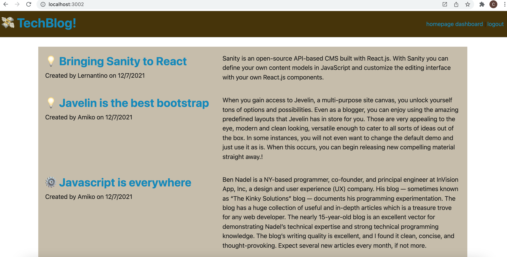

# tech-blog

## Description ##

Brief description of application:

Link to deployed app: <https://express-note-taker-cmp.herokuapp.com/notes>

This application will produces a techblog CMS type application for creating and view technical blog posts. 

USER STORY
AS A developer who writes about tech
I WANT a CMS-style blog site
SO THAT I can publish articles, blog posts, and my thoughts and opinions

This readme includes: Description, Table of Contents, Installation, Usage, License, Contributing, Tests, and Questions. You are free to add as much detail or as little as you like.

Note: this application is covered by the  license

## Table of Contents ##

* [Installation](#installation)
* [Usage](#usage)
* [License](#license)
* [Contributing](#contributing)
* [Tests](#tests)¬¬
* [Questions](#questions)

- - -

## Installation ##
Below are brief instructions on how to install:

You will need node.js with the inquirer package. You can download the basic javascript files to build the readme, but they have dependencies on node.js and inquirer. If you clone the repo, then you can simply run npm init -y in the terminal from the folder directory, and then install inquirer using npm install inquirer.  You will also need to set up a mysql instance (we used JAWS_DB on heroku), and a .env to run locally

## Usage ##
How to use this application: 

You can signup, login, add posts, and view posts. 

## License ##
This application is covered by the following license: 

Creative Commons license family 4.0

## Contributing ##
This project was developed by Chris Pysden as part of the UW Bootcamp Certificate Course for Full Stack Developers. If you would like to contribute to improving this project, then you'd be very welcome. Please follow the following guidelines (which are loosely based on Atom project guidelines):

* send an email to me using the links below to request to be added to the project and improvements briefly describe the improvements you'd like to make
* always create a new branch that encapsulates your changes
* notifiy me before commiting any updates/changes
* track all bugs as issues in the project
* have fun

## Tests ##
Tests included are referenced below:

Test:  

I am working on implementing some basic tests to check validity of the input and to ensure consistency. Currently there are no tests that ship with the code.

## Questions ##

My Github profile is here: <https://github.com/cpysden-coder>

Please contact me with questions at <chris_pysden@mac.com>
